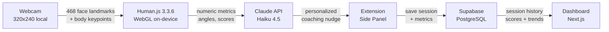

# PostureGuard

**Real-time posture detection and AI-powered recovery coaching — right in your browser.**

> 619 million people worldwide suffer from low back pain. 65 million Americans report it yearly, costing $134.5 billion in healthcare spending. The #1 cause of disability globally isn't an injury — it's how we sit.

[Live Demo](https://posture-guard-hackasu.vercel.app) · [Chrome Extension](#chrome-extension) · [Demo Video](#demo)

---

## The Problem

The average desk worker sits 6–7.5 hours a day, and their posture steadily degrades — especially after lunch. Existing solutions are reactive: you only notice the damage when it becomes chronic pain. Ergonomic chairs cost hundreds. Wearable sensors are intrusive. "Sit up straight" lasts about 30 seconds.

**PostureGuard catches posture drift in real time and coaches you back before pain sets in.**

## What It Does

PostureGuard is a **Chrome extension** paired with a **Next.js health app** that monitors your posture through your webcam, nudges you with AI-generated coaching, and guides you through targeted recovery exercises.

- **Detects** forward head tilt, slouching, shoulder asymmetry, lateral head tilt, screen distance, shoulder shrug, and trunk lean
- **Scores** your posture in real time against a personal calibrated baseline using a rolling 30-second window
- **Nudges** you with Claude-generated coaching tips after sustained bad posture (configurable 15s–120s threshold)
- **Guides** you through personalized exercises selected based on your detected posture issues
- **Tracks** sessions with scores, slouch events, good streaks, posture trends, and historical analytics

All camera processing happens **locally in your browser** via WebGL. Only numerical metrics (angles, distances, scores) are ever sent to Claude. No video, no images, no biometric data hits any server.

---

## Demo

<!-- Replace with actual screenshots/GIFs -->
<!--  -->

**Key Screens:**

| Landing Page | Detection Overlay | Exercise Flow | Session Dashboard |
|:-:|:-:|:-:|:-:|
| Animated spine HUD with health statistics | Color-coded dot (green/yellow/red) with pulsing alerts | Timer-based exercises with video demos | Session history with color-coded scores |

---

## How It Works



### Detection Pipeline

1. **Posture Core** (`posture-core.js`) creates a hidden 320x240 video element, initializes Human.js with WebGL backend, and runs a detection loop at ~30fps using `requestVideoFrameCallback` with RAF fallback. A `detectInProgress` flag prevents overlapping inference calls.

2. **Content Script** (`content.js`) relays raw landmarks to the background service worker via `chrome.runtime.sendMessage`. The background is the single source of truth for scoring.

3. **Background Analyzer** (`background.js`) extracts metrics from face mesh landmarks (nose tip, eye centers, chin, forehead — indices 1, 33, 362, 152, 10) and MoveNet body keypoints (ears, shoulders, hips). It calculates:
   - **Forward head tilt** — nose-to-eye-line distance ratio vs calibrated baseline
   - **Lateral head tilt** — eye-line angle deviation from horizontal
   - **Slouch** — face bounding box size change (closer = larger face = leaning forward)
   - **Screen distance** — inter-pupillary distance ratio (shrinks as you move away)
   - **Shoulder asymmetry** — shoulder-line angle deviation (body keypoints)
   - **Shoulder shrug** — ear-to-shoulder distance change
   - **Trunk lean** — shoulder midpoint vs hip midpoint horizontal offset

4. **Scoring** uses a weighted composite (forward 30%, slouch 25%, lateral 20%, distance 10%, shoulder 10%, shrug 5%) with One-Euro filtering for jitter reduction. Score 100 = perfect posture, 0 = worst.

5. **Nudge System** — when score stays below 50 for the configured threshold, Claude API (Haiku 4.5) receives the numeric metrics and returns a contextual 1-sentence coaching tip. Tips are cached to avoid repetition, with a 2-minute cooldown between API calls. Fallback tips are used if the API is unavailable.

6. **Session End** — when the timer completes (1–10 min configurable), the session is automatically saved to Supabase with full metrics, slouch events, good streak data, posture trend, and body metric averages.

### Calibration

Before first use, the user calibrates by sitting in their natural good posture. The system captures 60 frames (~2 seconds) of landmark positions, averages them into a baseline, and saves to `chrome.storage.local`. A live camera preview with green face border overlay guides the user through a 3-second countdown.

---

## Features

### Chrome Extension
- **Real-time ML detection** — Human.js 3.3.6 face mesh (468 points) + MoveNet body keypoints via WebGL, ~30fps
- **Personal calibration** — baseline captured from your natural sitting position
- **Non-intrusive overlay** — small color-coded dot (bottom-right), pulsing red animation for bad posture, slide-in nudge notifications
- **Single-tab lock** — only one tab owns the camera; session persists across tab switches
- **Side panel UI** — toggle monitoring, calibrate, adjust sensitivity (15s–120s), set session duration (1–10 min), view live score, manage API key
- **Auth bridge** — signs in through the health app via a dedicated `/auth/extension` bridge page, stores tokens in Chrome storage
- **Session tracking** — slouch events (confirmed after 10s), good streaks, worst periods with dominant issue detection, posture trend (first vs second half)

### Health App
- **Landing page** — animated spine HUD visualization, scrolling health statistics with count-up animations (55M desk workers, $134.5B healthcare costs, 619M low back pain cases globally), blog cards
- **Exercise flow** — 10 targeted exercises (chin tucks, shoulder rolls, neck stretches, back extensions, hip flexor stretch, shoulder blade squeeze, cat-cow stretch, spinal twist, chest opener stretch, neck isometrics) with timer countdowns, video/image demos, and motivational quotes
- **Smart exercise selection** — exercises are scored and ranked by how well they match your detected posture issues (`forward_head`, `slouch`, `shoulder_asymmetry`, `lateral_tilt`, `screen_distance`), with Claude analysis issues weighted 2x
- **Session dashboard** — last 20 sessions, color-coded scores (green >= 70, yellow >= 50, red < 50), duration and alert count
- **Privacy page** — typewriter-animated privacy statement explaining HIPAA minimum necessary principle alignment, on-device processing, OAuth 2.0, Chrome CSP compliance
- **Blog** — 3 articles on posture science, scoring methodology, and AI ergonomics
- **Auth** — Google OAuth + email/password via Supabase, with extension redirect support

---

## Tech Stack

| Layer | Technology |
|-------|-----------|
| **ML / Vision** | Human.js 3.3.6, TensorFlow.js, WebGL, MoveNet |
| **AI Coaching** | Claude API (claude-haiku-4-5-20251001) |
| **Extension** | Chrome Manifest V3, Vanilla JS, Chrome Storage API, Side Panel API |
| **Web App** | Next.js 14.2.3, React 18, Tailwind CSS 3.4.1 |
| **Auth** | Supabase Auth (Google OAuth + email), SSR + browser clients |
| **Database** | Supabase PostgreSQL |
| **UI** | Radix UI (45+ primitives), Recharts, Framer Motion, Lucide icons |
| **Forms** | React Hook Form + Zod validation |
| **Signal Processing** | One-Euro Filter (landmark smoothing) |
| **Deployment** | Vercel |

---

## Getting Started

### Prerequisites
- Node.js 18+
- Chrome browser
- Supabase project with a `sessions` table
- Anthropic API key

### Chrome Extension

```bash
# 1. Clone the repo
git clone https://github.com/your-username/PostureGuard.git

# 2. Open Chrome → navigate to chrome://extensions
# 3. Enable "Developer Mode" (top-right toggle)
# 4. Click "Load unpacked" → select the extension/ folder
# 5. Click the PostureGuard icon to open the side panel
# 6. Sign in → Calibrate → Enable monitoring
```

Enter your Anthropic API key in Settings (gear icon) for Claude-powered nudges.

### Health App

```bash
cd health-app
yarn install

# Set up environment variables
cp .env.example .env.local
# Fill in:
#   NEXT_PUBLIC_SUPABASE_URL
#   NEXT_PUBLIC_SUPABASE_ANON_KEY
```

```bash
yarn dev
# Opens at http://localhost:3000
```

**Production:** Deployed on Vercel at [posture-guard-hackasu.vercel.app](https://posture-guard-hackasu.vercel.app)

---

## Project Structure

```
PostureGuard/
├── extension/                      # Chrome Extension (Manifest V3)
│   ├── manifest.json               # MV3 config: sidePanel, storage, tabs, notifications
│   ├── background.js               # Service worker — posture scoring, Claude API, session tracking
│   ├── content.js                  # Landmark relay to background, nudge/score dispatch to overlay
│   ├── posture/
│   │   ├── posture-core.js         # Human.js init, webcam pipeline, ~30fps detection loop
│   │   ├── posture-analyzer.js     # Thin relay — proxies session data from background
│   │   ├── posture-cal.js          # Calibration UI: 60-frame capture with live face preview
│   │   ├── posture-overlay.js      # Color-coded indicator dot, nudge slide-ins, pulse animation
│   │   ├── posture-overlay.css     # Overlay styles (z-index: 2147483647, pointer-events: none)
│   │   └── human/                  # Vendored Human.js + TensorFlow models
│   ├── sidepanel/
│   │   ├── sidepanel.html          # Extension panel: auth, controls, live score, session stats
│   │   ├── sidepanel.js            # Panel logic: toggle, calibrate, settings, report generation
│   │   └── sidepanel.css
│   ├── lib/
│   │   ├── auth.js                 # Token management (Supabase access/refresh)
│   │   └── auth-bridge.js          # Content script for /auth/extension token extraction
│   ├── utils/
│   │   ├── debug-logger.js         # [PostureGuard] prefixed console logging
│   │   ├── one-euro-filter.js      # Signal smoothing for landmark jitter
│   │   └── qr-bridge.js            # QR code generation for session data
│   └── icons/                      # 16/32/48/128px extension icons
│
├── health-app/                     # Next.js 14 Web App
│   ├── app/
│   │   ├── page.js                 # Landing: spine HUD, stats scroll, blog cards
│   │   ├── login/page.js           # Google OAuth + email auth
│   │   ├── flow/page.js            # Exercise session: 10 exercises, timers, video demos
│   │   ├── dashboard/page.js       # Session history: last 20, scores, alerts
│   │   ├── privacy/page.js         # Typewriter privacy statement
│   │   ├── blog/                   # 3 posture science articles
│   │   ├── auth/
│   │   │   ├── callback/route.js   # OAuth callback handler
│   │   │   └── extension/page.js   # Extension auth bridge (token handoff)
│   │   └── api/
│   │       ├── sessions/route.js   # GET (list) + POST (save) sessions
│   │       ├── sessions/[id]/      # GET session, POST workout
│   │       ├── auth/token/         # Access token for extension
│   │       ├── auth/refresh/       # Token refresh
│   │       └── vault/              # Secure data storage
│   ├── components/
│   │   ├── StatsScroll.js          # Animated health statistic cards with count-up
│   │   ├── BlogCards.js            # Blog post preview cards
│   │   └── ui/                     # 48 Radix UI + shadcn components
│   └── lib/
│       ├── supabase.js             # Browser + server Supabase clients
│       ├── supabase-api.js         # Dual auth: cookie (web) + Bearer token (extension)
│       └── utils.js                # Tailwind merge utility
│
├── CLAUDE.md                       # Claude Code development guidelines
└── PLAN.md                         # Full development plan and architecture
```

---

## API Routes

| Method | Route | Purpose |
|--------|-------|---------|
| `GET` | `/api/sessions` | List user's last 20 sessions |
| `POST` | `/api/sessions` | Save a new posture session with metrics + Claude analysis |
| `GET` | `/api/sessions/[id]` | Fetch single session details |
| `POST` | `/api/sessions/[id]/workout` | Start or update a workout for a session |
| `POST` | `/api/auth/token` | Get access token for Chrome extension |
| `POST` | `/api/auth/refresh` | Refresh expired auth tokens |
| `POST` | `/api/vault` | Secure data storage |

All API routes support dual authentication: cookie-based (health app web UI) and Bearer token (Chrome extension).

---

## Privacy

PostureGuard is **privacy-first by design**, aligning with HIPAA's minimum necessary principle:

- **On-device processing** — webcam feed is processed entirely in-browser via WebGL. No video or images are ever transmitted.
- **Metrics only** — only derived numerical values (angles, distances, scores) are sent to Claude API for coaching.
- **No tracking** — no third-party analytics, no cookies beyond auth, no ad networks.
- **User control** — start/stop detection at any time. Camera only activates when monitoring is explicitly enabled.
- **Secure auth** — OAuth 2.0 via Supabase. Extension tokens scoped and stored in Chrome storage.
- **CSP compliant** — Chrome extension follows Content Security Policy principles to prevent unauthorized data access.

---

## Built At

**HackASU 2026** — Biology & Physical Health Track (March 20–22, 2026)

Hosted by the Claude Builder Club at Arizona State University. Built with Anthropic's Claude API.

## Team

- **Sarath** — Chrome Extension (posture detection, ML pipeline, Claude integration)
- **Ashish** — Health App (Next.js, exercise flow, dashboard, landing page)

---

## What's Next

- [ ] Multi-person posture detection for shared workspaces
- [ ] Weekly/monthly trend reports with AI-generated insights
- [ ] Standing desk integration for auto sit/stand adjustments
- [ ] Mobile companion app
- [ ] Exportable health reports for physical therapists
- [ ] 3D exercise demos with Mixamo/Three.js

---

<p align="center">
  <i>Sit better. Feel better. Code better.</i>
</p>
